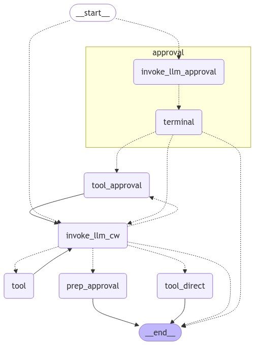

# LP02

This package contains some prototype code to learn more about LangGraph and multi-Agent workflows.  It presents a chat experience using a Streamlit web interface and provides access to a couple of GenAI Agents.  The first Agent is an "expert" an AWS CloudWatch and can retrieve the metrics for an Amazon OpenSearch Domain as well as create CloudWatch Dashboards for those metrics.  The second Agent is used to confirm user approval for write operations (e.g. creating a Dashboard).  The benefit of the second Agent is that we're able to guarantee that the user provides an explicit approval through a completely separate process rather than trying to finagle the system prompt for the CloudWatch Expert Agent and hope for the best.

This workflow is [orchestrated using LangGraph](https://github.com/langchain-ai/langgraph) and runs against Claude 3.5 Sonnet running in AWS Bedrock.  The session graph looks like this:




### Running the code

#### Locally
To run the code locally, use a Python virtual environment.  You'll need AWS Credentials in your AWS Keyring, permissions to invoke Bedrock, and to have onboarded your account to use Claude 3.5 Sonnet.

```
# Start in the repo root

python3 -m venv venv
source venv/bin/activate

cd lp02
pipenv sync --dev
pipenv run streamlit run start_chat.py
```

This will launch a Streamlit app, which should redirect you to your default browser and allow you to chat w/ the Agents.

### Dependencies
`pipenv` is used to managed dependencies within the project.  The `Pipefile` and `Pipefile.lock` handle the local environment.  You can add dependencies like so:

```
pipenv install boto3
```

This updates the `Pipfile`/`Pipfile.lock` with the new dependency.  To create a local copy of the dependencies, such as for bundling a distribution, you can use pip like so:

```
pipenv requirements > requirements.txt
python3 -m pip install -r requirements.txt -t ./package --upgrade

zip -r9 lp02.zip tools/ package/
```